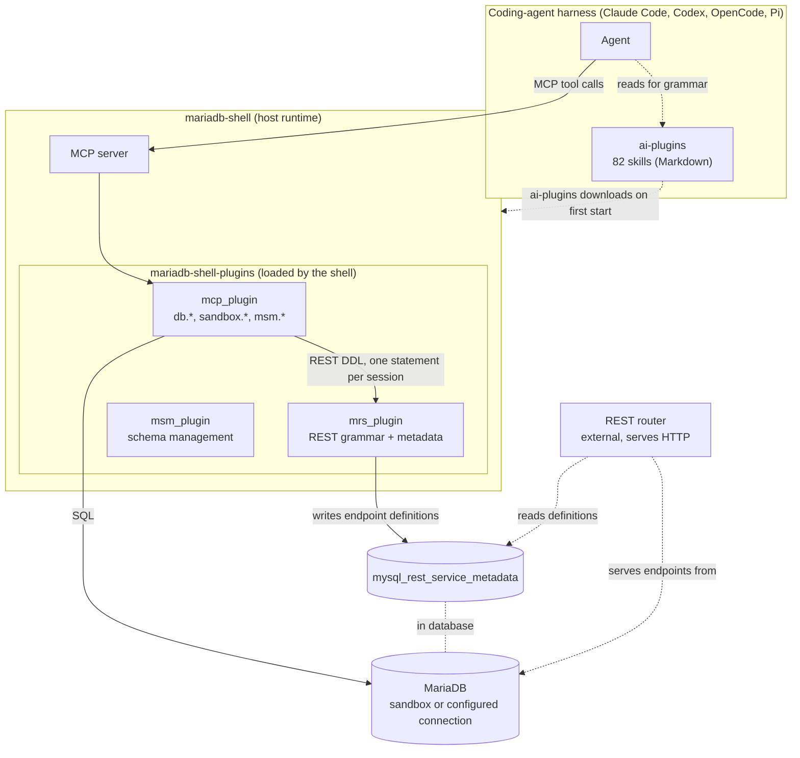

# The MariaDB AI Plugins stack: layering and relationships

A reference for describing how the pieces fit together, in Q&A and on the deck. The stack is three layers, plus two external pieces that sit outside the chain.

## The three layers

| Layer                   | What it is                                                                | Provides                                                                | You install it |
| ----------------------- | ------------------------------------------------------------------------- | ---------------------------------------------------------------------- | -------------- |
| `ai-plugins`            | The harness plugin for Claude Code, Codex, OpenCode and Pi.               | 82 MariaDB skills (Markdown, no code), and the wiring that launches the MCP server. | Yes            |
| `mariadb-shell`         | The host runtime, derived from MySQL Shell.                               | The MCP server, the connection secret store, and the allowed-paths guard. Loads the plugins from `~/.mariadb-shell/plugins`. | Automatic      |
| `mariadb-shell-plugins` | The plugins the shell loads.                                              | `mcp_plugin` (the 28 MCP tools), `mrs_plugin` (REST grammar and metadata), `msm_plugin` (schema management). | Automatic      |

You install only the top layer. Installing `ai-plugins` downloads the `mariadb-shell` package, and that package bundles the plugins, so the tools you call (`db.*`, `sandbox.*`, `msm.*`, and the REST grammar) are implemented in the bottom layer rather than the middle one.

## How they relate

Solid arrows are the live request path. Dashed arrows are dependencies or reads.

## What happens on one prompt

1. The agent matches the task to a skill in `ai-plugins` and loads its Markdown for the grammar, the ordering rules, and the failure modes the model never trained on.
2. The agent calls an MCP tool, the harness routes the call to the `mariadb-shell` MCP server, and the server dispatches it to `mcp_plugin`.
3. For schema work, `mcp_plugin` runs SQL against MariaDB, either a configured connection or a sandbox it deployed. For the API tier, the REST DDL runs through `db.execute_sql` one statement at a time, and `mrs_plugin` writes the endpoint definitions into the `mysql_rest_service_metadata` schema.
4. The agent reads the result back and fixes what failed, closing its own loop.

## The split that matters

- **Skills carry knowledge.** They are Markdown in `ai-plugins`, reviewed and versioned like the rest of the project, with no code and no fine-tuning, and they tell the model the MariaDB-specific things it is otherwise confidently wrong about.
- **Tools carry capability.** The MCP server in `mariadb-shell`, backed by `mariadb-shell-plugins`, opens the connection, deploys the instance, and runs the statements.
- Reading a transcript through that split tells you where a run failed. Wrong SQL is a skills gap, and a refused connection or a blocked path is a tools problem.

## Two pieces outside the chain

- **The MariaDB server.** A sandbox instance deployed by `sandbox.*`, or a database you configured, it holds the schema and, once REST is set up, the `mysql_rest_service_metadata` schema too.
- **The REST router.** Serving `/notesApp` over HTTP is a MySQL-Router-family binary that reads the endpoint definitions from the metadata and serves them. It is external to the shell, it is not an MCP tool, and you bootstrap it yourself, since the plugin only registers and lists routers rather than starting one.

## Say it in one line

- **The whole stack.** "One harness plugin ships the MariaDB knowledge as skills and the ability to run SQL as an MCP server, so the agent can design a schema and execute it against a live database in the same loop."
- **The layers.** "`ai-plugins` is the skills and the wiring, `mariadb-shell` is the runtime that hosts the MCP server, and `mariadb-shell-plugins` is where the tools and the REST grammar are actually implemented."
- **Skills versus tools.** "Skills are the grammar the model never learned. Tools are the connection and the instance. You need both to finish the job."
- **The REST tier.** "The REST Service is administered entirely through SQL DDL, so the same MCP connection that builds the schema also builds the API. Serving it over HTTP is a separate router you run yourself."
