# demo schema — ER diagram

MariaDB `demo` schema (Sakila DVD-rental port). 16 tables, 7 views, 6 stored routines.

- **Solid lines** = foreign-key relationships between tables.
- **Dashed lines** = view/routine dependencies (`reads`) and routine-to-routine `calls`.
- View/routine entities are tagged in their first row (`VIEW`, `FUNCTION`, `PROCEDURE`) since Mermaid `erDiagram` has no native node type for them.

```mermaid
erDiagram
    %% ---------- Foreign-key relationships (base tables) ----------
    country ||--o{ city : "has"
    city ||--o{ address : "has"
    address ||--o{ store : "located at"
    address ||--o{ staff : "lives at"
    address ||--o{ customer : "lives at"

    store ||--o{ inventory : "stocks"
    store ||--o{ customer : "serves"
    store ||--o{ staff : "employs"
    staff ||--o| store : "manages"

    language ||--o{ film : "spoken"
    language ||--o{ film : "original"
    film ||--o{ inventory : "copied as"
    film ||--o{ film_actor : ""
    actor ||--o{ film_actor : ""
    film ||--o{ film_category : ""
    category ||--o{ film_category : ""

    inventory ||--o{ rental : "rented as"
    customer ||--o{ rental : "makes"
    staff ||--o{ rental : "handles"
    rental ||--o{ payment : "billed as"
    customer ||--o{ payment : "pays"
    staff ||--o{ payment : "collects"

    %% ---------- Base tables ----------
    country {
        smallint country_id PK
        varchar country
    }
    city {
        smallint city_id PK
        varchar city
        smallint country_id FK
    }
    address {
        smallint address_id PK
        varchar address
        varchar district
        smallint city_id FK
        varchar postal_code
        varchar phone
    }
    store {
        tinyint store_id PK
        tinyint manager_staff_id FK "UNIQUE"
        smallint address_id FK
    }
    staff {
        tinyint staff_id PK
        varchar first_name
        varchar last_name
        smallint address_id FK
        tinyint store_id FK
        varchar username
        tinyint active
    }
    customer {
        smallint customer_id PK
        tinyint store_id FK
        smallint address_id FK
        varchar first_name
        varchar last_name
        varchar email
        tinyint active
        datetime create_date
    }
    language {
        tinyint language_id PK
        char name
    }
    film {
        smallint film_id PK
        varchar title
        text description
        year release_year
        tinyint language_id FK
        tinyint original_language_id FK
        tinyint rental_duration
        decimal rental_rate
        decimal replacement_cost
        enum rating
        set special_features
    }
    film_text {
        smallint film_id PK
        varchar title
        text description
    }
    actor {
        smallint actor_id PK
        varchar first_name
        varchar last_name
    }
    category {
        tinyint category_id PK
        varchar name
    }
    film_actor {
        smallint actor_id PK,FK
        smallint film_id PK,FK
    }
    film_category {
        smallint film_id PK,FK
        tinyint category_id PK,FK
    }
    inventory {
        mediumint inventory_id PK
        smallint film_id FK
        tinyint store_id FK
    }
    rental {
        int rental_id PK
        datetime rental_date
        mediumint inventory_id FK
        smallint customer_id FK
        datetime return_date
        tinyint staff_id FK
    }
    payment {
        smallint payment_id PK
        smallint customer_id FK
        tinyint staff_id FK
        int rental_id FK
        decimal amount
        datetime payment_date
    }

    %% ---------- Views ----------
    actor_info {
        VIEW _
        col actor_id
        col first_name
        col last_name
        col film_info
    }
    customer_list {
        VIEW _
        col ID
        col name
        col address
        col city
        col country
        col SID
    }
    film_list {
        VIEW _
        col FID
        col title
        col category
        col price
        col actors
    }
    nicer_but_slower_film_list {
        VIEW _
        col FID
        col title
        col category
        col actors
    }
    sales_by_film_category {
        VIEW _
        col category
        col total_sales
    }
    sales_by_store {
        VIEW _
        col store
        col manager
        col total_sales
    }
    staff_list {
        VIEW _
        col ID
        col name
        col address
        col city
        col country
        col SID
    }

    %% ---------- Stored routines ----------
    get_customer_balance {
        FUNCTION returns_decimal
        in p_customer_id
        in p_effective_date
    }
    inventory_held_by_customer {
        FUNCTION returns_int
        in p_inventory_id
    }
    inventory_in_stock {
        FUNCTION returns_bool
        in p_inventory_id
    }
    film_in_stock {
        PROCEDURE _
        in p_film_id
        in p_store_id
        out p_film_count
    }
    film_not_in_stock {
        PROCEDURE _
        in p_film_id
        in p_store_id
        out p_film_count
    }
    rewards_report {
        PROCEDURE _
        in min_monthly_purchases
        in min_dollar_amount_purchased
        out count_rewardees
    }

    %% ---------- View dependencies (reads) ----------
    actor ||..o{ actor_info : reads
    film_actor ||..o{ actor_info : reads
    film_category ||..o{ actor_info : reads
    category ||..o{ actor_info : reads
    film ||..o{ actor_info : reads

    customer ||..o{ customer_list : reads
    address ||..o{ customer_list : reads
    city ||..o{ customer_list : reads
    country ||..o{ customer_list : reads

    film ||..o{ film_list : reads
    film_category ||..o{ film_list : reads
    category ||..o{ film_list : reads
    film_actor ||..o{ film_list : reads
    actor ||..o{ film_list : reads

    film ||..o{ nicer_but_slower_film_list : reads
    film_category ||..o{ nicer_but_slower_film_list : reads
    category ||..o{ nicer_but_slower_film_list : reads
    film_actor ||..o{ nicer_but_slower_film_list : reads
    actor ||..o{ nicer_but_slower_film_list : reads

    payment ||..o{ sales_by_film_category : reads
    rental ||..o{ sales_by_film_category : reads
    inventory ||..o{ sales_by_film_category : reads
    film ||..o{ sales_by_film_category : reads
    film_category ||..o{ sales_by_film_category : reads
    category ||..o{ sales_by_film_category : reads

    payment ||..o{ sales_by_store : reads
    rental ||..o{ sales_by_store : reads
    inventory ||..o{ sales_by_store : reads
    store ||..o{ sales_by_store : reads
    address ||..o{ sales_by_store : reads
    city ||..o{ sales_by_store : reads
    country ||..o{ sales_by_store : reads
    staff ||..o{ sales_by_store : reads

    staff ||..o{ staff_list : reads
    address ||..o{ staff_list : reads
    city ||..o{ staff_list : reads
    country ||..o{ staff_list : reads

    %% ---------- Routine dependencies (reads / calls) ----------
    film ||..o{ get_customer_balance : reads
    inventory ||..o{ get_customer_balance : reads
    rental ||..o{ get_customer_balance : reads
    payment ||..o{ get_customer_balance : reads

    rental ||..o{ inventory_held_by_customer : reads

    rental ||..o{ inventory_in_stock : reads
    inventory ||..o{ inventory_in_stock : reads

    inventory ||..o{ film_in_stock : reads
    inventory_in_stock ||..o{ film_in_stock : calls

    inventory ||..o{ film_not_in_stock : reads
    inventory_in_stock ||..o{ film_not_in_stock : calls

    payment ||..o{ rewards_report : reads
    customer ||..o{ rewards_report : reads
```

