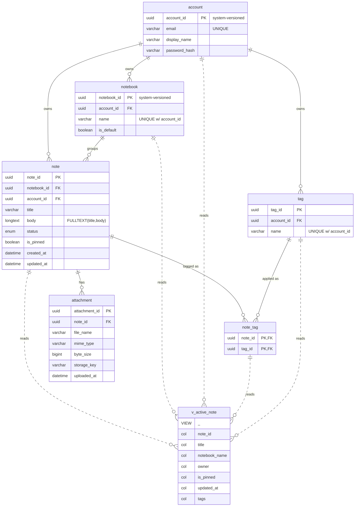

# notes_app schema — ER diagram

MariaDB `notes_app` schema (note-taking application, targets MariaDB 11.8+). 6 tables, 1 view, 0 stored routines.

- **Solid lines** = foreign-key relationships between tables.
- **Dashed lines** = view dependencies (`reads`).
- View entities are tagged in their first row (`VIEW`) since Mermaid `erDiagram` has no native node type for them.
- `account` and `notebook` are `WITH SYSTEM VERSIONING` (tagged on their PK row). Every FK uses `ON DELETE CASCADE`.

